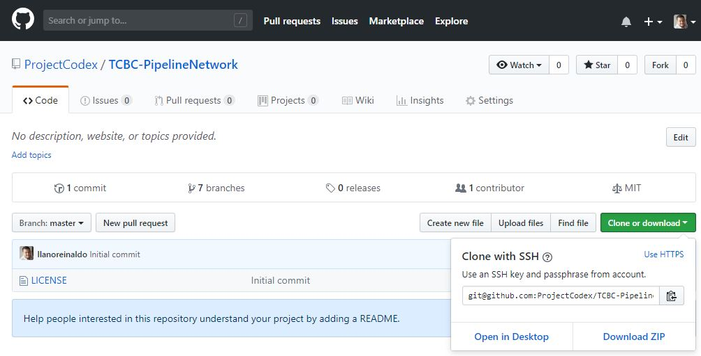
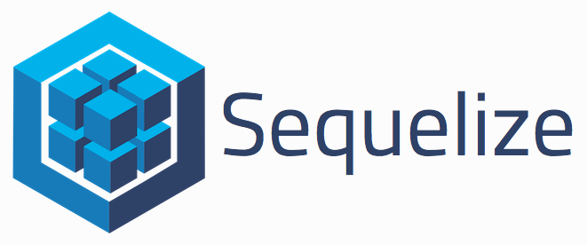
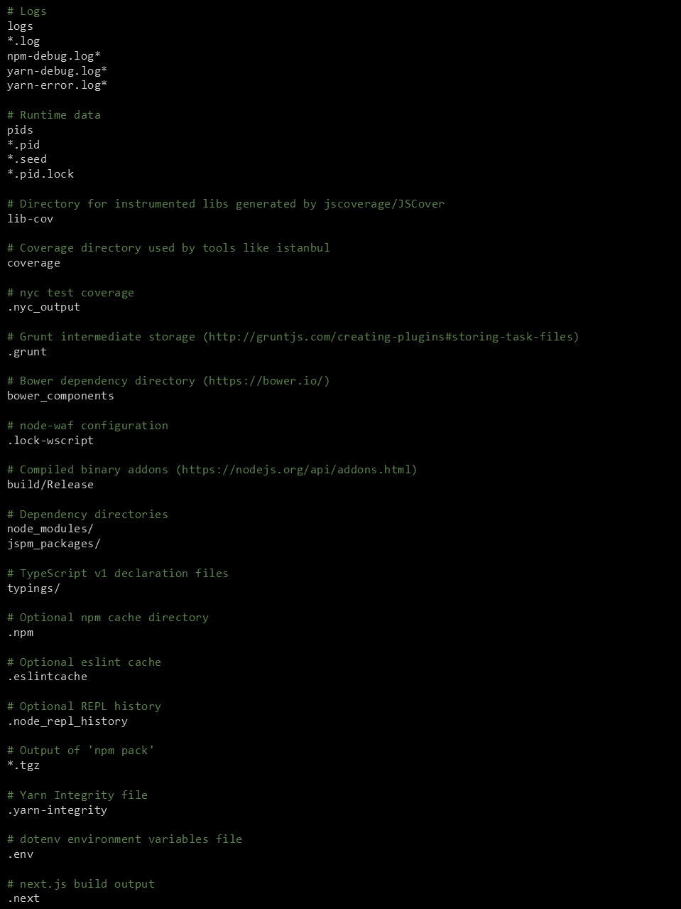

<center> 

# The Coding Boot Camp Pipeline Network Open Source Project </center>

<p align="center">
  
</p>


# Table of Contents: 

* [About Our Project](#Project)
* [Project Description](#Description)
* [How to Install](#Installation)
* [Usage](#Usage)
* [Contributing](#Contributing)
* [Credits](#Credits)
* [License](#License)

<center>

## <a name="Product"></a>About Our Project</center>

#### Project Scope
The Coding Boot Camp Pipeline Network Open Source Project seeks to leverage the awesome talents of new and expert coders to build a web based application that will:

1.  Help capture important and relevant information about its members work experience, programming knowledge, training, hidden talents and interests.
2.  Help connect students with graduates, mentees with mentors, job seekers with hiring managers, and entreprenuers with expert advisers.
3.  Help contributors gain valuable experience in the web development cycle (creating, scoping, architecting, coding, collaborating, and promoting) to further enhance their marketability as an prospective employee.


<center>

## <a name="Description"></a>Product Description</center>

The Coding Boot Camp Pipeline Network Open Source Project will build a web based application that handles a membership-based searchable database in order to foster valuable connections, creativity and collaborations.  The application allows users to connect with others for job opportunities, mentoring, and open source collaboration.  Users will be able to import their linkedIn profile and expand it into a more comprehensive profile to give members a deeper dive into their work experience, their education, their passions and interest, and their career aspirations.

<center>

## <a name="Installation"></a>How to Install </center>

*** This is a potential list of NPM Packages that could be used for this project.  Contributors can decide on whether there are more relevant packages or programs we should use.  For Example:  Should we use Php Laravel framework to start.  The group can really drive this based on their experience (or interest in developing experience).***


The following are instructions for downloading this GitHub repository in order to duplicate this site application.  

1. First clone this GitHub repository to your local folder. 

<p align="center">

</p>
 

1. After cloning this GitHub reposirtory on your local folder where you plan to install the application.  Then run ```npm i``` to implement all the required   dependency package files.  


#### Implemented  Packages





#### Create a standard .gitnore file 

> Create the .gitnore file and make sure it has the following code:




<center>

## <a name="Usage"></a>Usage</center>

### TBD

<center>

## <a name="Contributing"></a>Contributing</center>

### TBD

<center>

## <a name="Credits"></a>Credits</center>

* "Reinaldo Llano"<reinaldo@projectcodex.biz> - Application Team Leader and and Full Stack Developer
* "Lee Warrick" <lee@projectcodex.biz> - Application Co-Team Leader and Full Stack Developer
* "Jon Disla" <jon@projectcodex.biz> - Full Stack Developer
* "Your Name Here" <youremail@example.com> - Your Title
<center>

## <a name="License"></a>License</center>

>   [MIT](https://github.com/ProjectCodex/TCBC-PipelineNetwork/blob/master/LICENSE)
